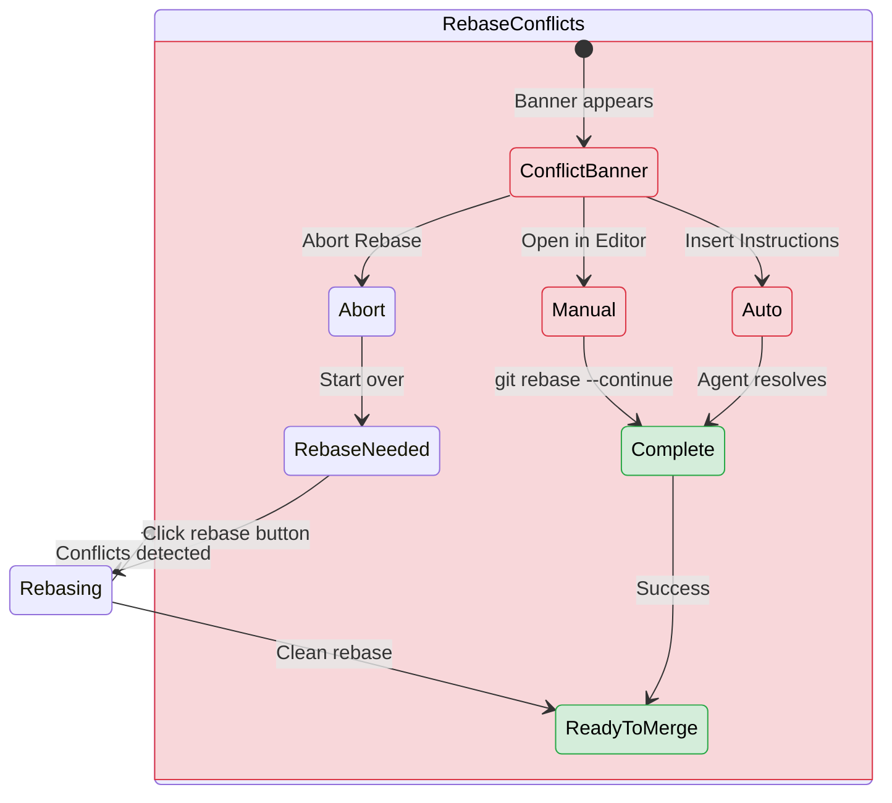

## When You See "Rebase Conflicts"

Your task status changed from "Rebase needed" to "Rebase conflicts" because the base branch advanced and your changes conflict with the new changes.

## Conflict Resolution States



## Resolution Options

### Option 1: Manual Resolution

<Steps>
<Step title="Open in Editor">
  Click **Open in Editor** from the conflict banner.
</Step>

<Step title="Edit conflicted files">
  Resolve merge markers in each file:
  ```diff
  <<<<<<< HEAD (your changes)
  your code
  =======
  base branch code  
  >>>>>>> main
  ```
</Step>

<Step title="Continue rebase">
  ```bash
  git add resolved-file.js
  git rebase --continue
  ```
</Step>
</Steps>

### Option 2: Automatic Resolution

<Steps>
<Step title="Insert instructions">
  Click **Insert Resolve-Conflicts Instructions** from the conflict banner.
</Step>

<Step title="Send to agent">
  Review the generated instructions and click **Send**.
</Step>
</Steps>

<Frame>

</Frame>

The agent will:
1. Analyze conflicted files
2. Make resolution decisions
3. Run `git rebase --continue` automatically

## Quick Actions

- **Abort Rebase** - Returns to "Rebase needed" state
- **Open in Editor** - Manual resolution in your IDE
- **Insert Instructions** - Let the coding agent resolve

## What Happens Next

Once conflicts are resolved, your task status returns to **Ready to Merge** and the merge button becomes available.

<Note>
The conflict banner shows above the follow-up text field and provides three resolution options.
</Note>
