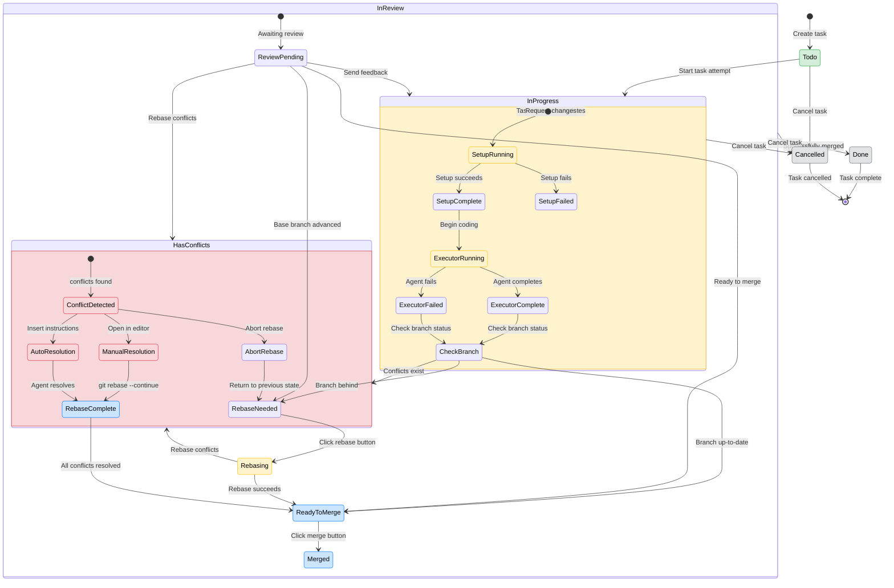
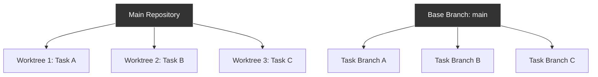
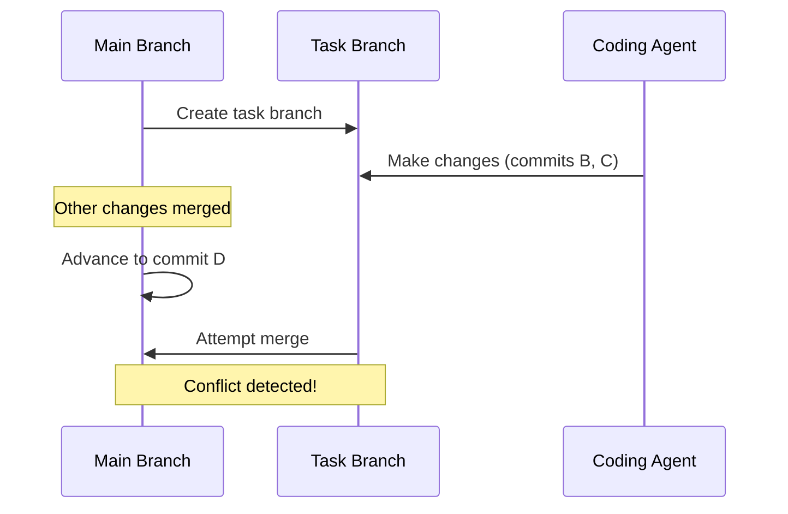

When your task is running on a branch that becomes outdated, you'll need to rebase onto the latest version of your base branch. Sometimes this process results in merge conflicts that need to be resolved before you can continue.

## Task Status State Machine

Understanding the different states your task can be in helps you know exactly what actions are available and how to proceed toward a successful merge.



### Key States Explained

**Primary Task States:**
- **Todo** - Task created but not started
- **In Progress** - Task attempt is actively running or ready to run
- **In Review** - Task completed, awaiting review/merge
- **Done** - Successfully merged and complete
- **Cancelled** - Task cancelled at any stage

**Branch Status Indicators:**
- **Ready to Merge** - Branch is up-to-date and can be merged
- **Rebase Needed** - Base branch has advanced, rebase required
- **Has Conflicts** - Merge conflicts need resolution

**Conflict Resolution States:**
- **Conflict Detected** - System identified conflicted files
- **Manual Resolution** - User editing files manually
- **Auto Resolution** - Coding agent resolving conflicts
- **Rebase Complete** - All conflicts resolved, ready to merge

## Understanding Git Worktrees and Branching

Vibe Kanban uses Git worktrees to create isolated environments for each task attempt. This ensures that multiple tasks can run simultaneously without interfering with each other.



Each task attempt:
1. Creates a new branch from your chosen base branch (e.g., `main`)
2. Creates an isolated worktree environment
3. Allows the coding agent to work without affecting other tasks

## When Conflicts Occur

Conflicts arise when your base branch advances while your task is in progress. This commonly happens when:

- Team members merge other pull requests
- You merge other completed tasks
- Automated processes update the base branch



## The Rebase Process

When conflicts occur, Vibe Kanban provides tools to resolve them through a structured rebase process.

### Step 1: Detecting Outdated Branches

The interface automatically detects when your task branch is behind the base branch and displays a **Rebase** button.

<Frame>

</Frame>

### Step 2: Initiating the Rebase

When you see the **Rebase** button, the base branch has already been determined from when you created the task. Simply click the button to start the rebase process.

<Steps>
<Step title="Click the Rebase button">
  Click the **Rebase** button to rebase your task branch onto the latest version of the base branch.
</Step>

<Step title="Wait for the process to complete">
  The system will automatically rebase your changes onto the current base branch.
</Step>
</Steps>

<Note>
The base branch was set when you originally created the task. The rebase process updates your task branch to include the latest changes from that base branch.
</Note>

### Step 3: Handling the Results

After initiating the rebase, one of three outcomes occurs:

<Tabs>
<Tab title="Clean Rebase">
  If there are no conflicts, the rebase completes automatically. The status changes from "Rebase needed" and the **Merge** button becomes available.
  
  <Check>
  Your task branch is now up-to-date with the base branch and ready to merge.
  </Check>
</Tab>

<Tab title="Merge Conflicts">
  If conflicts exist, the status changes from "Rebase needed" to "Rebase conflicts" and you'll see a conflict resolution banner.
  
  <Warning>
  The rebase process is paused until conflicts are resolved.
  </Warning>
</Tab>

<Tab title="Rebase Error">
  If the rebase fails for other reasons (e.g., uncommitted changes), you'll receive an error message with next steps.
</Tab>
</Tabs>

## Resolving Conflicts

When conflicts occur, you have two resolution options:

### Option 1: Manual Resolution

For developers comfortable with Git, you can resolve conflicts manually:

<Steps>
<Step title="Open in editor">
  Click **Open in Editor** from the conflict banner to access the worktree files directly.
  
  <Note>
  The conflict banner appears above the follow-up text field and provides three resolution options when conflicts occur.
  </Note>
</Step>

<Step title="Edit conflicted files">
  Open each conflicted file and resolve the merge markers:
  
  ```diff
  <<<<<<< HEAD (your changes)
  function newFeature() {
    return "new implementation";
  }
  =======
  function oldFeature() {
    return "existing implementation";
  }
  >>>>>>> main (base branch changes)
  ```
</Step>

<Step title="Stage resolved files">
  After editing, stage the resolved files:
  
  ```bash
  git add resolved-file.js
  ```
</Step>

<Step title="Continue the rebase">
  Complete the rebase process:
  
  ```bash
  git rebase --continue
  ```
</Step>
</Steps>

### Option 2: Automatic Resolution with Coding Agents

For a more automated approach, let the coding agent resolve conflicts:

<Steps>
<Step title="Access the conflict resolution banner">
  When conflicts occur, a banner appears above the follow-up text field with three options:
  - **Open in Editor** - Opens the worktree files for manual editing
  - **Insert Resolve-Conflicts Instructions** - Auto-generates conflict resolution instructions
  - **Abort Rebase** - Cancels the rebase and returns to the previous state
</Step>

<Step title="Insert conflict resolution instructions">
  Click **Insert Resolve-Conflicts Instructions** from the conflict banner.
  
  <Note>
  This generates specific instructions tailored to your conflict situation and inserts them into the follow-up message area.
  </Note>
</Step>

<Step title="Review generated instructions">
  The system automatically generates instructions that include:
  - List of conflicted files
  - Context about the rebase operation
  - Specific commands to run after resolution
  
  <Frame>
  
  </Frame>
</Step>

<Step title="Send to coding agent">
  Click **Send** to have the coding agent attempt automatic resolution.
</Step>

<Step title="Monitor progress">
  The agent will:
  1. Analyze the conflicted files
  2. Make intelligent decisions about conflict resolution
  3. Stage the resolved files
  4. Continue the rebase process automatically
</Step>
</Steps>

<Tip>
Automatic resolution works best for straightforward conflicts. For complex merge conflicts involving significant architectural changes, manual resolution may be more appropriate.
</Tip>

## Understanding Conflict Types

Different types of conflicts require different approaches:

<AccordionGroup>
<Accordion title="Content conflicts">
  Both branches modified the same lines of code. These require careful review to ensure the correct logic is preserved.
  
  **Best resolved by**: Manual review or coding agent with specific context
</Accordion>

<Accordion title="Rename conflicts">
  One branch renamed a file while another modified it. These typically have clear resolution paths.
  
  **Best resolved by**: Coding agent with automatic instructions
</Accordion>

<Accordion title="Delete/modify conflicts">
  One branch deleted a file while another modified it. Requires decision about whether to keep or remove the file.
  
  **Best resolved by**: Manual review to make the business decision
</Accordion>
</AccordionGroup>

## Aborting a Rebase

If you need to cancel the rebase process entirely:

<Steps>
<Step title="Click Abort Rebase">
  From the conflict banner, click **Abort Rebase** to return to the state before the rebase started.
</Step>

<Step title="Consider alternatives">
  After aborting, you can:
  - Try rebasing onto a different branch
  - Create a new task attempt from the updated base branch
  - Continue with the current branch and resolve conflicts later during merge
</Step>
</Steps>

<Warning>
Aborting a rebase discards any partial conflict resolutions. You'll need to start the resolution process again if you retry the rebase.
</Warning>

## Best Practices

### Before Starting Tasks

- **Create tasks from recent base branches** to minimise the likelihood of conflicts
- **Keep task scopes focused** to reduce the surface area for potential conflicts
- **Communicate with your team** about significant base branch changes

### During Development

- **Monitor base branch changes** through your project's notification systems
- **Rebase early and often** rather than waiting until task completion
- **Review conflicts carefully** even when using automatic resolution

### When Conflicts Arise

- **Start with automatic resolution** for simple conflicts to save time
- **Use manual resolution** for complex architectural changes
- **Test thoroughly** after conflict resolution to ensure functionality is preserved

<Check>
Following these practices will help you handle merge conflicts efficiently and maintain code quality throughout the development process.
</Check>

## Troubleshooting

<AccordionGroup>
<Accordion title="Rebase button not appearing">
  **Possible causes:**
  - Your branch is already up-to-date
  - A rebase is already in progress
  - The task is not in a rebaseable state
  
  **Solution:** Check the task status and ensure no other git operations are running.
</Accordion>

<Accordion title="Automatic resolution fails">
  **Possible causes:**
  - Conflicts are too complex for automatic resolution
  - Binary files are conflicted
  - The coding agent lacks sufficient context
  
  **Solution:** Switch to manual resolution or provide additional context in your instructions.
</Accordion>

<Accordion title="Worktree becomes corrupted">
  **Possible causes:**
  - Interrupted git operations
  - File system issues
  - Manual changes outside Vibe Kanban
  
  **Solution:** Create a new task attempt to start with a clean worktree environment.
</Accordion>
</AccordionGroup>
